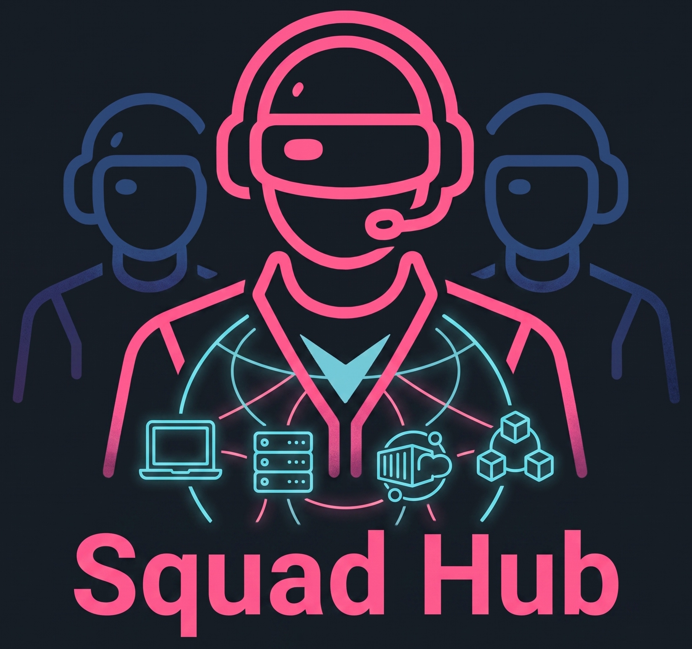
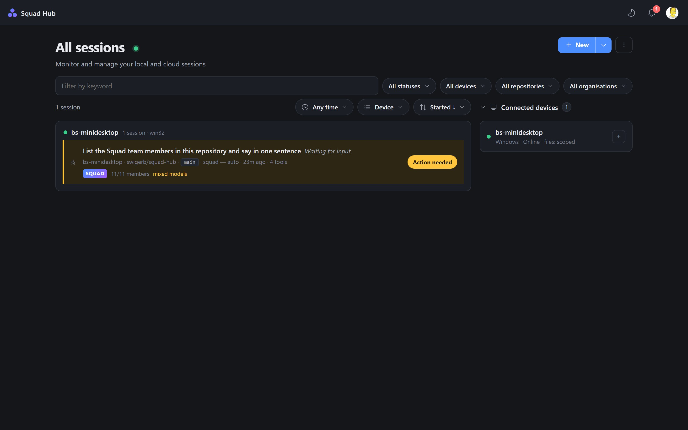
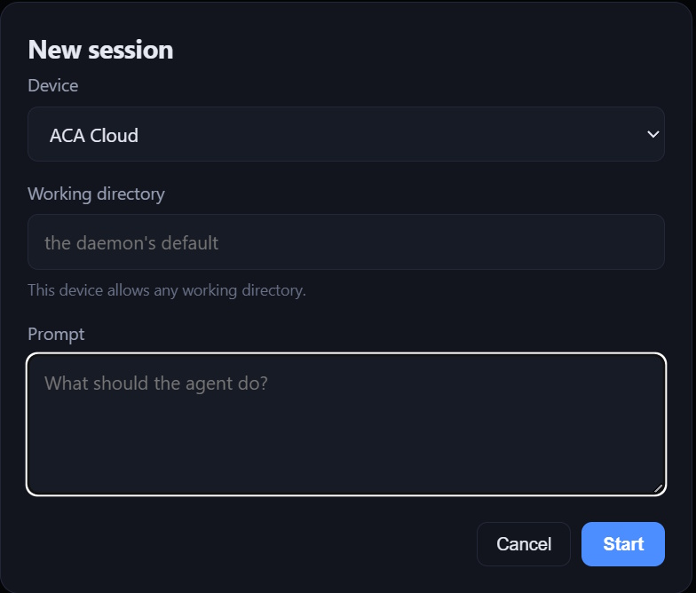
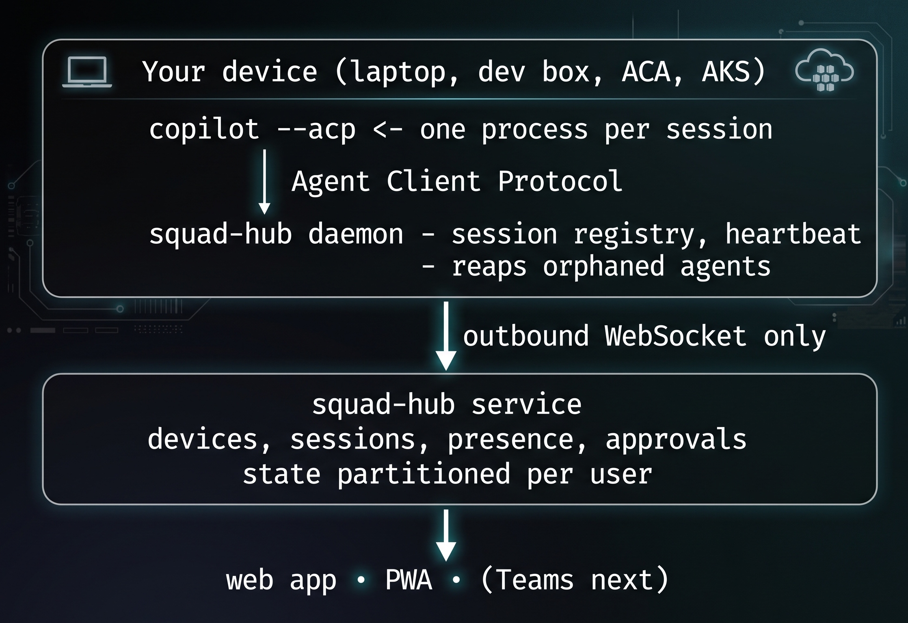

<p align="center">
  
</p>

<h1 align="center">Squad Hub</h1>

<p align="center">
  One place to see and control your <a href="https://github.com/bradygaster/squad">Squad</a> sessions —
  on your laptop, a dev box, an Azure Container App, or a Kubernetes pod.
</p>

---

## The problem

Squad sessions run in more places than one person can watch. Two things go wrong
the moment you step away from a keyboard:

1. **You lose sight of what is running.** There is no single view.
2. **Agents stall.** A session that pauses for tool approval waits until you
   return to *that machine*. On a 45-minute run that is the difference between
   finishing and not.

Squad Hub fixes both.

<p align="center">
  
</p>

## What it does

| | |
|---|---|
| **See everything** | One live list of every session, grouped by device |
| **Device presence** | Online, stale, or offline, from a heartbeat |
| **Answer approvals remotely** | The card shows the literal command and the paths it touches |
| **Start a session anywhere** | Pick a device, write a prompt |
| **Steer and stop** | Send follow-up input, or cut a run short |
| **Squad-aware** | Reads `.squad/` for team, decisions, and model policy |
| **On your phone** | Installable as a PWA |

<p align="center">
  
</p>

## Try it

```bash
# 1. run the service
squad-hub serve

# it prints a URL with a token, and the command to attach a device

# 2. attach this machine
squad-hub start --hub http://localhost:7420 --token <token>

# 3. start a session
squad-hub run "add a health endpoint and a test for it"
```

Open the printed URL. When the agent asks to run something, the card appears —
on your desktop, or your phone.

Everything works from the CLI too:

```bash
squad-hub status          # sessions, and what each is waiting for
squad-hub approve <session> <approval> allow_once
squad-hub kill <session>
```

## How it works

<p align="center">
  
</p>

The daemon dials **out**, so nothing has to be opened on your laptop or dev box.

## Running it in the cloud

The simplest option is **Azure App Service** — native Node, no container, about
$13/month:

```powershell
./scripts/deploy-appservice.ps1 -ResourceGroup rg -Name my-squad-hub
```

The script refuses to deploy a configuration that cannot carry a device, and
verifies the build it pushed is the one serving.

Container Apps and Kubernetes are also supported, and can additionally run a
**cloud device** — a daemon in the cloud that appears in the device list beside
your laptop:

```powershell
./scripts/deploy-aca.ps1 -ResourceGroup rg -Environment cae -Registry acr -WithCloudDevice
./scripts/deploy-aks.ps1 -ResourceGroup rg -Cluster aks -Registry acr -HubUrl https://... -HubToken ... -AgentToken ...
```

Give a cloud device a GitHub token and it runs a real agent:

```
SQUAD_HUB_URL          the hub service
SQUAD_HUB_TOKEN        identifies the DEVICE to the hub
SQUAD_HUB_AGENT_TOKEN  authorises the AGENT to GitHub
```

Those last two are deliberately separate. The hub token says which device this
is; the agent token spends a Copilot entitlement. Conflating them would let
anyone who can register a device also spend someone else's.

See [docs/cloud.md](docs/cloud.md).

## Security

**File access is off by default.** No folder picker, no directory browsing,
until you opt in:

```bash
squad-hub start --allow-files       # scoped to the launch directory
squad-hub start --allow-files-all   # the whole filesystem
```

The confinement root is enforced by the daemon and **never leaves the device** —
the service is told only whether file access is on and whether it is scoped.

**Per-user isolation** is structural, not a filter applied at read time. Every
lookup reaches into one subject's partition, so there is no code path that
returns another user's data and then remembers to remove it.

Run with `--auth entra` to require Microsoft Entra ID. Dev mode is for a single
trusted machine and will not pretend otherwise.

## A constraint worth knowing up front

**The Hub has to start the session.** A daemon cannot attach to a `copilot`
session you launched by hand — there is no supported attach surface. Sessions
begin through the Hub, as ACP clients.

## Testing

```bash
npm test              # the suite
node test/mutate.js   # break each mechanism, require a named test to fail
```

Two rules the suite follows:

**Assert side effects, not replies.** An approval test checks for a file the
agent could only create by actually running the command. An agent that ran a
denied command would report the denial just as convincingly.

**A test that cannot fail is decoration.** `test/mutate.js` disables each
load-bearing mechanism in turn and requires the test that claims to cover it to
fail *by name*. It has found several mechanisms with no real coverage —
including the entire orphan gate, which passed on Windows only because the OS
was cleaning up for us.

Evidence per sprint, including what each did *not* prove, is in [`docs/`](docs/).

## How it is built

Built on public specifications: the
[Agent Client Protocol](https://agentclientprotocol.com), GitHub Copilot CLI's
published flags, and Azure Web PubSub. Every protocol behaviour it depends on is
proven by a probe in [`spike/`](spike/), with the captured wire payloads
committed alongside.

No dependencies, and no build step for the web app.

## License

MIT.
